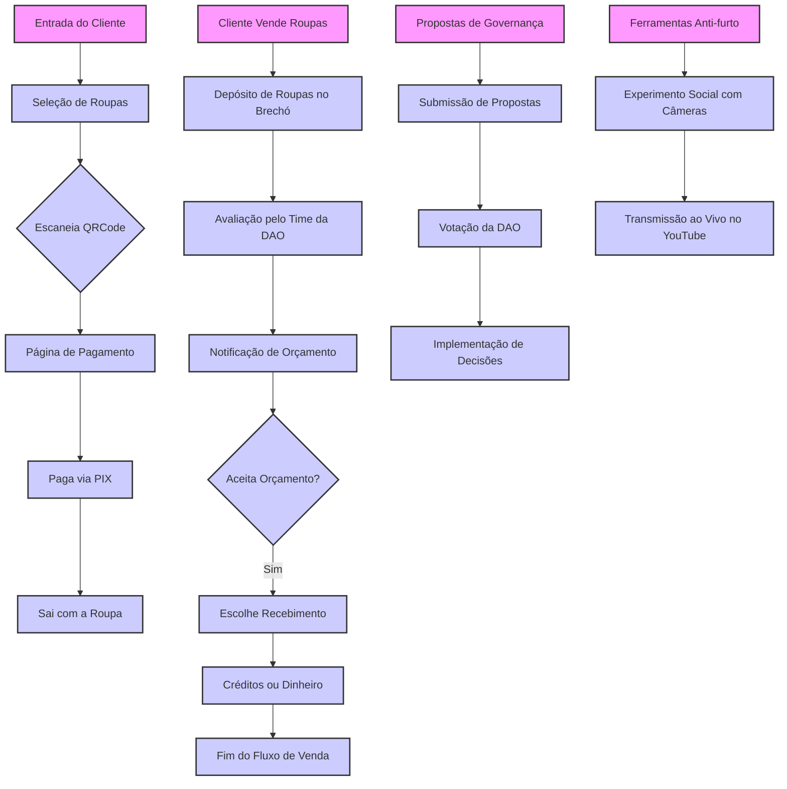

# Brechó Autônomo DAO

## Visão Geral

O Brechó Autônomo DAO é uma organização autônoma descentralizada (DAO) dedicada a administrar um brechó autônomo. Utilizando conceitos de experimento social e tecnologias de blockchain, este brechó opera de forma completamente autônoma, onde os clientes compram e vendem roupas usando um sistema baseado em QRCode e PIX.

## Fluxo de Funcionamento




## Funcionamento da Venda de Produtos

### Etapas de Compra:
1. **Seleção do Produto:** Os clientes selecionam produtos que desejam comprar, cada um marcado com um QRCode.
2. **Escaneamento e Pagamento:** Ao finalizar a escolha, os clientes escaneiam os QRCodes que direcionam para uma página de pagamento. A transação é concluída através de PIX, permitindo um processo de checkout rápido e sem intervenção humana.

### Fluxo de Recebimento de Novas Roupas:
1. **Depósito de Roupas:** Indivíduos interessados em vender roupas deixam seus itens em uma caixa no brechó.
2. **Avaliação e Orçamento:** O time da DAO avalia as roupas e envia uma notificação com o orçamento ao vendedor.
3. **Aceitação do Orçamento:** O vendedor tem 24 horas para aceitar o orçamento e escolher receber em dinheiro ou créditos (com cashback de 10%).

## Ferramentas Anti-furto

- **Experimento Social:** Placas informam que o ambiente está sendo gravado e transmitido ao vivo no YouTube para desencorajar furtos.
- **Transmissão ao Vivo:** A operação do brechó é transmitida ao vivo, aumentando a segurança e a transparência do processo.

## Governança da DAO

- **Propostas e Votações:** Membros da DAO podem submeter propostas relacionadas à operação do brechó, que são votadas de forma democrática.
- **Distribuição de Lucros:** Lucros obtidos com as vendas podem ser redistribuídos entre os membros ativos da DAO ou reinvestidos no brechó.
- **Admissão de Novos Membros:** Novos membros podem ser admitidos através de um sistema de indicação ou mediante cumprimento de critérios específicos estabelecidos pela DAO.

## Tecnologias Utilizadas

- **Blockchain:** Uso de contratos inteligentes para gerenciar transações e governança da DAO.
- **Sistema de Pagamento PIX:** Integração com sistemas de pagamento para facilitar transações rápidas e seguras.
- **QRCode:** Utilização de códigos QR para facilitar o processo de checkout autônomo.

---

# brecho_autonomo

## O que é um Brechó Autônomo?

Um Brechó Autônomo é um brechó que funciona de forma autônoma, sem a necessidade de um funcionário para gerenciar o brechó.

## Como funciona um Brechó Autônomo?

> Significado de Brechó
* Comercio de roupas usadas baseado em trocas ou vendas a preços baixos; bazar de roupas usadas.

## Fluxo de Compra de roupas em um Brechó Autônomo

1. O cliente entra no brechó e escolhe as roupas que deseja comprar.
2. O cliente escaneia o QRCODE do produto e faz o pagamento por PIX.
3. O cliente pega o produto e sai do brechó.

## Fluxo de Venda de roupas em um Brechó Autônomo

1. O cliente entra no brechó e coloca as roupas que deseja vender em uma caixa.
2. O cliente recebe uma notificação de orçamento.
3. O cliente aceita o orçamento e recebe o valor em Créditos ou em Dinheiro.

## Como funciona um Brechó Autônomo DAO?

É a ideia de criar um *protocolo DAO* para gerenciar e administrar um Brechó Autônomo. 

* Como todo protocolo de Web3 utilizamos uma moeda nativa para gerenciar e administrar o protocolo.

* A moeda nativa do protocolo Brechó Autônomo DAO é o *Brechó_COIN*.

* Vc poderá trocar as suas roupas por *Brechó_COIN*.

* Vc poderá trocar os seus *Brechó_COIN* por PIX real.

## Como funciona o lastro das *Brechó_COIN* ?

O lastro das *Brechó_COIN* é :

* valor das roupas que estão no brechó (Valor de estoque)

* valor de creditos a pagar. (ou seja, quando o cliente vende uma roupa ele recebe uma quantidade de *Brechó_COIN* com essa moeda o cliente poderá trocar por roupas em toda a rede de brechós que participam do protocolo Brechó Autônomo DAO)

## Como trocar as *Brechó_COIN* por PIX real?

O interesse do nosso protocolo é que você troque as suas *Brechó_COIN* por roupas.

Para quem desejar trocar *Brechó_COIN* - 40% do valor em PIX real.

Ou seja se vc tiver 100 *Brechó_COIN* vc poderá trocar por 40 reais em PIX real.

Ou 100 *Brechó_COIN* por compra em outras roupas do protocolo *Brechó_COIN*.

## O que é a *Brechó_COIN*?

A *Brechó_COIN* é uma moeda nativa do protocolo Brechó Autônomo DAO.

Ela é uma stable coin lastreada com real.

1 Real = 1 *Brechó_COIN* (SEMPRE)

## Como que garantimos que a *Brechó_COIN* sempre valerá 1 real?

A *Brechó_COIN* é uma moeda nativa do protocolo Brechó Autônomo DAO.
Sempre que roupas serem vendidas por *Brechó_COIN*, 30% do valor será depositado em Reais para o fundo de lastro da moeda.

Como foi dito anteriormente, a nossa intenção é trocar *Brechó_COIN* por roupas e não por PIX real.

Por tanto caso algum cliente queira trocar *Brechó_COIN* por PIX real, ele poderá trocar 30% do valor em PIX real.

Então caso as roupa seja avaliadas por 100 reais, o cliente conseguirá trocar 30 reais em PIX real.

## Eguação de calculo do lastro da *Brechó_COIN*

O lastro da *Brechó_COIN* é calculado da seguinte forma:

* valor das roupas que estão no brechó (Valor de estoque)
* valor de creditos a pagar. (ou seja, quando o cliente vende uma roupa ele recebe uma quantidade de *Brechó_COIN* com essa moeda o cliente poderá trocar por roupas em toda a rede de brechós que participam do protocolo Brechó Autônomo DAO)
* valor de creditos a receber. (ou seja, quando o cliente compra uma roupa ele paga uma quantidade de *Brechó_COIN* com essa moeda o cliente poderá trocar por roupas em toda a rede de brechós que participam do protocolo Brechó Autônomo DAO)
* vales presentes na rede de brechós que participam do protocolo Brechó Autônomo DAO.

```math
Lastro = Valor de estoque (roupas) + creditos a pagar (quantidade de *Brechó_COIN* emitidas - 70%) + creditos a receber (vales presentes)
```

> *Brechó_COIN* : é a moeda nativa do protocolo Brechó Autônomo DAO.

> Significado de *protocolo DAO* : é um conjunto de regras que define como os membros de uma organização autônoma descentralizada (DAO) interagem entre si e com a organização.

Tenho a ideia de ter um Brechó Autônomo DAO.

Quero que vc escreva a especificação do protocolo Brechó Autônomo DAO.

Uma DAO focada em gerenciar e administrar um Brechó Autônomo Decentralizado e Distribuído.

Essa DAO tem como objetivo implementar um Brechó Autônomo que utiliza uma ferramenta de experimento social.

Será um Brechó comum de roupas, aqueles de garagem mesmo.

Só que esse brechó funciona de forma Autônoma.

## Como a venda de produtos será feita?

Todos os produtos terão um QRCODE que levará o cliente ao link de pagamento.

O cliente irá scanear todos os  produtos e no final irá clicar em finalizar compra fazendo o pagamento por PIX. 

## Como nosso brechó autonomo faz a compra de novas roupas?

A pessoa colocará as roupas que tem interesse em vender em uma caixa e irá deixar no brechó. 

Nosso time irá avaliar as roupas e enviará uma notificação de orçamento para o cliente, o cliente terá 24 horas para aceitar o orçamento.

O Cliente pode aceitar o valor em Créditos(cash back 10%) ou em Dinheiro.

## Ferramentas ante furto

Utilizaremos uma ferramenta de experimento social onde terá placas informando que o ambiente está sendo gravado e está sendo transmitido ao vivo no youtube na live "Brechó Autônomo".

A ferramenta de experimento social será utilizada para testar a honestidade das pessoas.

## Quais são as formas que esse protocolo monetiza?

* 1 - Recebemos uma taxa para cada venda realizada no brechó. [Taxa 5% da venda]

* 2 - Certificamos novos Brechós Autônomos DAO vendemos a emissão de um certificado de Qualidade do Brechó.
    > - Criterios para certificação de um Brechó Autônomo DAO:

    * - O Brechó irá garantir a higienização e controle de qualidade de 
    todas as roupas expostas a venda.

    * - O Brechó irá garantir a recompra dos token emitidos em *Brechó_COIN*. seguindo a taxa de recompra de 30% do valor em PIX real.

    * - O Brechó irá seguir todos os parametros de higiene estipulados pelo protocolo Brechó Autônomo DAO.

    > # Vencimento da certificação: TODOS os certificados emitidos por esse protocolo tem a validade de 1 ano. É de responsabilidade do Brechós em passar pelo processo de renovação da certificação.

* 3 - Venda de outros produtos.

    - Balas, doces, refrigerantes, sucos, etc.
    - Utensilios usados

* 4 - Youtube

    - Recebemos uma taxa para cada visualização da live "Brechó Autônomo".
    - Recebemos uma taxa para cada inscrito no canal do youtube "Brechó Autônomo".
    - Fazemos propaganda de outros produtos no youtube.


## Glossário

* *Brechó_COIN* : é a moeda nativa do protocolo Brechó Autônomo DAO.
* *protocolo DAO* : é um conjunto de regras que define como os membros de uma organização autônoma descentralizada (DAO) interagem entre si e com a organização.
* *Brechó Autônomo* : é um brechó que funciona de forma autônoma, sem a necessidade de um funcionário para gerenciar o brechó.
* *Brechó Autônomo DAO* : é uma DAO focada em gerenciar e administrar um Brechó Autônomo Decentralizado e Distribuído.
* *QRCODE* : é um código de barras bidimensional que pode ser escaneado usando a câmera de um smartphone ou tablet.
* *PIX* : é um sistema de pagamento instantâneo brasileiro que permite transferências de dinheiro em tempo real, 24 horas por dia, 7 dias por semana, entre pessoas, empresas e governo.
* *Experimento Social* : é um tipo de estudo científico que investiga o comportamento humano em situações sociais específicas.
* Monetização : é o processo de transformar algo em dinheiro.


